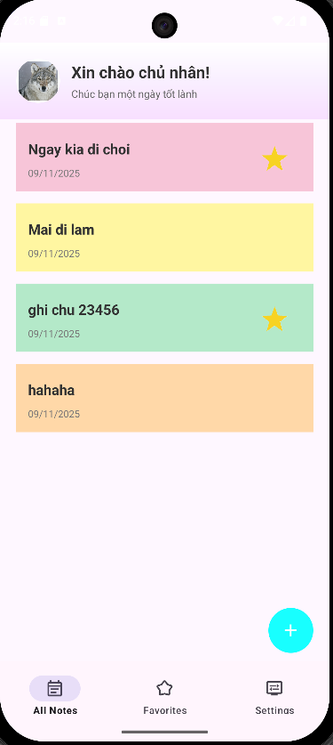
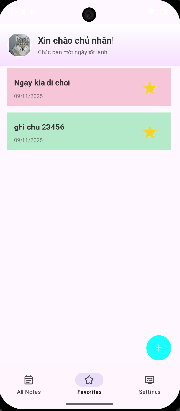
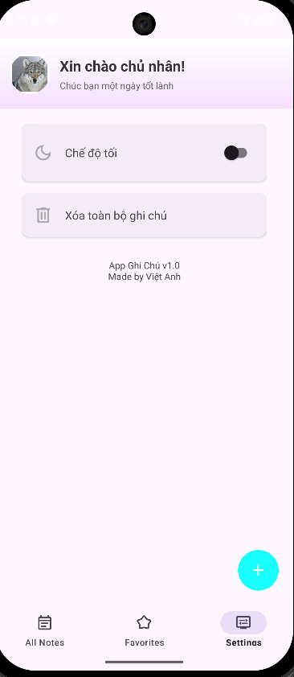
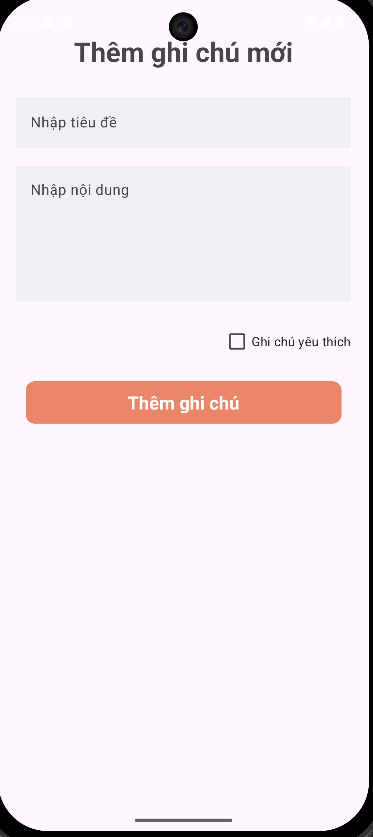
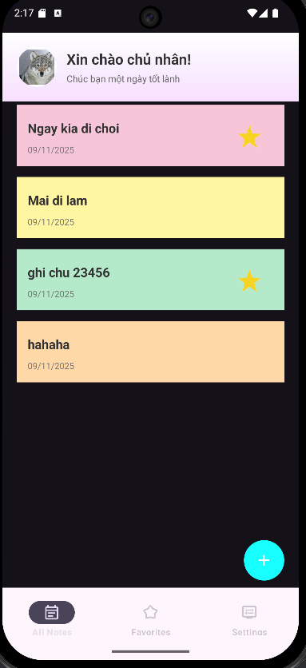

# 📝 App Note – Ứng dụng ghi chú (Kotlin)

Một ứng dụng ghi chú đơn giản, nhẹ, giao diện pastel đẹp mắt, hỗ trợ chế độ Dark/Light và lưu trữ bằng Room Database.

## ✨ Tính năng

✅ Thêm ghi chú  
✅ Sửa ghi chú  
✅ Xoá ghi chú  
✅ Xoá toàn bộ ghi chú  
✅ Đánh dấu yêu thích  
✅ Tự động đổi màu pastel cho từng ghi chú  
✅ Chế độ Light/Dark Mode  
✅ Giao diện có header chào người dùng  
✅ RecyclerView + ViewPager2 + BottomNavigation  
✅ Room Database + LiveData + Repository Pattern

---

## 📸 Giao diện

### Light mode
<p float="left">
  
  
  
  
</p>

### Dark mode


---

## 🏗️ Công nghệ sử dụng

- Kotlin  
- Android Jetpack  
- Room Database  
- LiveData
- ViewPager2  
- BottomNavigationView  
- Material Components  
- SharedPreferences  

```md
## 📦 Kiến trúc dự án

📁 com.example.appnote  
│  
├── 📁 data  
│   ├── Note.kt  
│   ├── NoteDao.kt  
│   ├── AppDatabase.kt  
│   ├── ColorsNote.kt  
│   └── NoteRepository.kt  
│  
├── 📁 pref  
│   └── UserPrefs.kt  
│  
├── 📁 ui  
│   ├── MainActivity.kt  
│   ├── AllNotesFragment.kt  
│   ├── FavoritesFragment.kt  
│   ├── SettingFragment.kt  
│   ├── AddNoteActivity.kt  
│   └── EditNoteActivity.kt  
│  
├── ViewPagerAdapter.kt  
└── NoteAdapter.kt  
